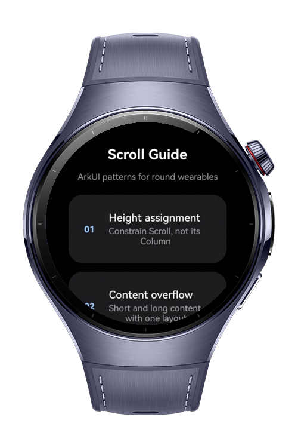
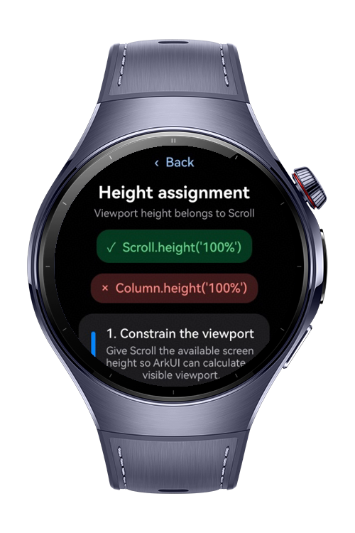
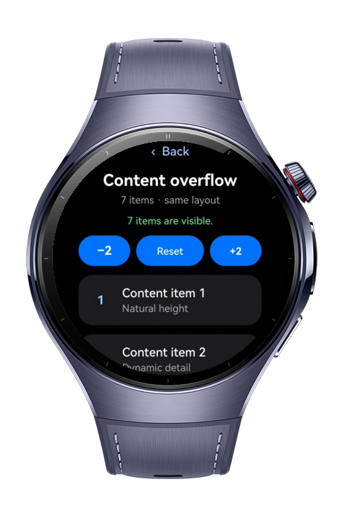
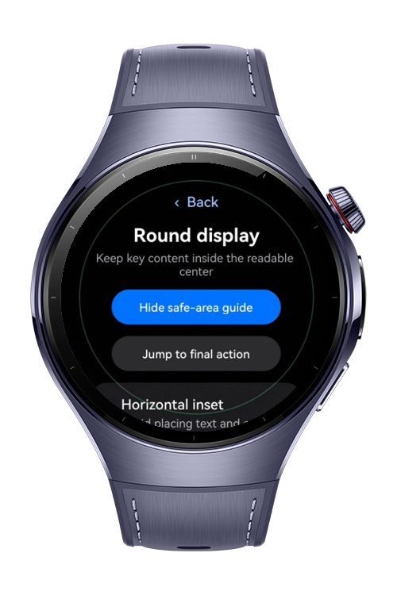

> **Note:** To access all shared projects, get information about environment setup, and view other guides, please visit [Explore-In-HMOS-Wearable Index](https://github.com/Explore-In-HMOS-Wearable/hmos-index).

# How to Properly Implement Scroll Components on HarmonyOS Wearables

This app is an ArkTS/ArkUI wearable reference project that demonstrates how to correctly assign height between Scroll
and its child components, handle short and overflowing content with the same layout, and optimize scrollable pages for
round displays. It also uses the MVVM architecture to separate UI rendering, application state, and data models.

# Preview

<div> 
   
   
   
   
</div> 

# Use Cases

* Assign the available screen height to the Scroll component while allowing its child Column to grow naturally.
* Avoid incorrect scroll ranges caused by assigning .height('100%') to scrollable content.
* Use the same layout for both short and overflowing content.
* Dynamically add, remove, and reset content items.
* Navigate programmatically to the top or bottom of a scrollable page.
* Apply safe padding to prevent content from being clipped near the curved edges of a round display.
* Leave sufficient bottom spacing so the final control remains visible and reachable.
* Separate UI state and layout logic by using the MVVM architecture.

# Technology

## Stack

* **Languages**: ArkTS, ArkUI
* **Frameworks**: HarmonyOS SDK 6.0.1(21)
* **Tools**: DevEco Studio 6.0.1, Hvigor
* **Libraries**:

    * `@kit.ArkUI`
    * `@kit.AbilityKit`

# Directory Structure

```text
entry/src/main/ets/
├── components/
│   └── GuideComponents.ets
├── entryability/
│   └── EntryAbility.ets
├── model/
│   └── ScrollModels.ets
├── pages/
│   └── Index.ets
├── viewmodel/
│   └── ScrollGuideViewModel.ets
└── views/
    ├── HeightAssignmentView.ets
    ├── HomeView.ets
    ├── OverflowView.ets
    └── RoundScreenView.ets
```

# Constraints and Restrictions

## Supported Device

* Huawei Watch 5
* DevEco Studio wearable simulator

# License

**How to Properly Implement Scroll Components on HarmonyOS Wearables** is distributed under the terms of the MIT
License. See the [LICENSE](LICENSE) for more information.